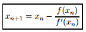
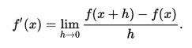

# Introduction #

It was decided to use newton-raphson method to solve simultaneous set of equations. This article
is divided into two main sections, first which explains what the algorithm is and what are the
conditions for getting a solution for the equations and second is the implementation part.

## Newton-Raphson Method ##

Newton raphson method is a numerical based approximation method where we iteratively solve for 
the value of the variables. Using it with topomath would mean that we would be solving the system 
of equation for each time step and use the values from the previous time step.

This method uses equations in the form `f(x) = 0` where x is a D dimension vector of variables.
At every iteration the value of the x is improved using: 

Here, f\`(x) is `D X D` Jacobian Matrix (first order derivative of the f(x) with respect to
each variable). Whether the this method can continue at each step needs to check:

1. Whether the function is differentiable at the point.
2. Whether the Jacobian is a square matrix or not and the determinant is non-zero.
3. Whether the inverse of the Jacobian exists, that is if the matrix is invertible (non singular matrix).
4. We need an upper limit of the number of iterations as well for the convergence, as if we start
at a lot of distance from the solution, Newton-Raphson might never reach the solution.

Differentiability of a function is nothing but the continuity of the function at that point.
We can test it by checking if the `f(x)` is in `p(x)/q(x)` form, then it is non differentiable
at every point where `q(x) = 0`.

To check if the inverse of the Jacobian exists, we dont need to perform an extra test and just
calculate the inverse using [Gauss-Jordan Elimination](http://mathworld.wolfram.com/Gauss-JordanElimination.html)
method. If after the inverse calculation the rank of the matrix is D then we have the solution.
If at any time we find that the rank of the matrix is less than what we see then we might not
have a solution to our equation.

Upper limit for number of iterations will be tested during the trial, by seeing how much time
does the whole algorithm takes.

## Implementation Details ##

There are a particular smaller modules needed to be calculated and tested separately. They are:

* Jacobian Matrix calculation - calculate the first order derivative of the function using
	.
* Inverse of the Jacobian Matrix calculation - This will be calculated using Gauss Jordan elimination
method which is a known method for calculating inverse of the matrix.
* Matrix multiplication
* Matrix addition

The exact implementation details with the functions will ve added once a detailed implementation plan is complete.
