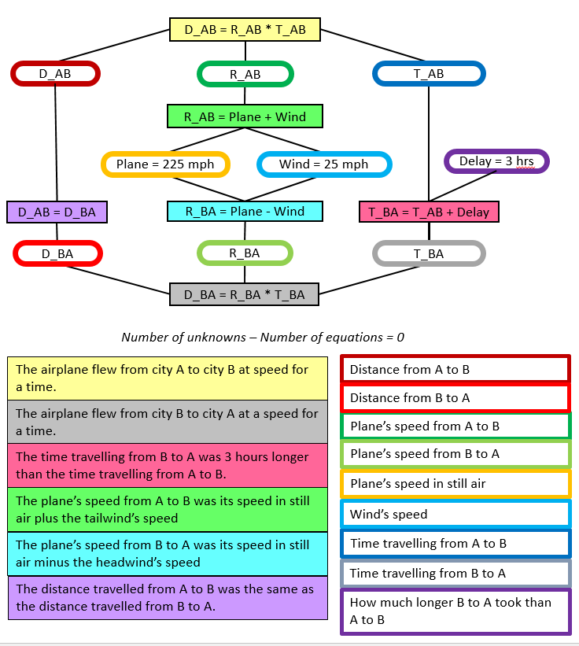

# User Interface #

This part of Topomath works show Model - which consists of nodes in JSON format, to Nodes 
on a user screen. The requirements for this part was to show quantity nodes as cylindrical 
structure, and equation nodes as square boxes. Each node will be connected based on the
equations. Each quantity and equation node will have a description which will be shown 
on the left side of the screen. See the image below. In the image you see that 
the descriptions are below the model, where as it was later decided to move the descriptions
to the left side of the screen. Implementing these requirements were divided into three
major parts, which are described below.

### Implementation details ###

The major modules are:

* Nodes UI -- This part consists of showing both equations and quantity nodes, using css
and js modules. The information needed to completely show them are the node properties,
the node completeness check and a randomly picked color values to show either the border
for quantity nodes or the background color for equation nodes. The values shown on each
comes from the node properties. Quantity nodes show the node variable name, with the value.
There is a logic behind it which shows different types of nodes (unknown, parameter,
dynamic) differently.
* Node connections -- JSplumb library was used to show the connections between the nodes.
These dojo layer for the library was already written and can be found
[at](https://github.com/bhosaledipak/JsPlumb_Dojo_Integreate). This wrapper was also
used in Dragoon and integration strategy was replicated from there.
* Node descriptions -- The values shows are nothing but node descriptions here and the
border or background color. The implementation was done using simple js tricks.

### Feedback to Node ###

Feedback to student's is provided in Immediate Feedback mode only. No feedback mode serves as editor.

Feedback is shown on the node's border. Following are the rules followed - 
* The body of the nodes now always have solid borders.
Icons in the top left of the node will be empty for green and yellow nodes, if the node is incomplete (new behavior in bold, unchanged behaviors in normal font):
* If no description selected yet: grey node with no icon and text "Click here!"
Else if node has an incorrect value: icon has red border with "x" (same as now)
Else if user took too many tries on one field (got a yellow), but node is still incomplete: yellow border with no icon in center
Else if user took too many tries on one field (got a yellow), but node is complete: yellow border with minus sign
Else if node is complete and all answers input so far are correct on the first try: green border with gold star
Else if node is complete and all everything is correct but not on the first try: green border with green check
Else if node is incomplete but all answers input so far are correct: green border with no icon in center

Feedback is also given as Position of nodes. 'fp' parameter controls the position of node in student mode.

### Files ###

The major files used for the complete debvelopment are:
* [graph-objects.js](https://github.com/Dragoon-Lab/topomath/blob/master/www/js/graph-objects.js) --
This file creates the html structure for a node. Which is added to everytime
a node is created.
* [draw-model.js](https://github.com/Dragoon-Lab/topomath/blob/master/www/js/draw-model.js) --
This is the file which closely works with other modules of Topomath, especially the
[model.js](https://github.com/Dragoon-Lab/topomath/blob/master/www/js/model.js).
This contains the logic create a new node, connect it using jsplumb, update nodes 
when the values are updated, show node border and background colors, handle two 
types of node click events (click and move).
* [state-machine.css](https://github.com/Dragoon-Lab/topomath/blob/master/www/css/state-machine.css) --
This file has the css for connections and node shapes, cylindrical for quantity and
square for equation node. This also has the css for the descriptions to be shown on
the left side of the screen.
